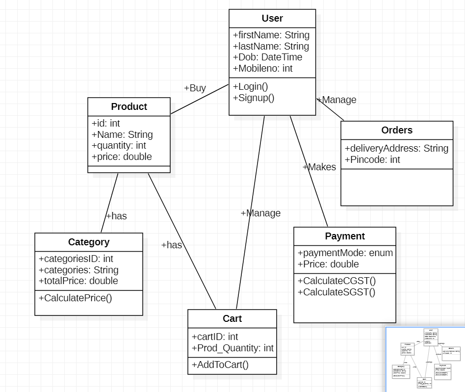

HIGH LEVEL DESIGN:

PROPOSED SYSTEM:

- Online shopping is a lifestyle e-commerce web application which retails various fashion and lifestyle products.
- This project allows viewing various products available, enables new users to register and registered users to select and purchase desired products instantly using payment process by card and also can place the order by using cash on delivery option.
- The objective of this project is to develop a general purpose e-commerce store where product like clothes can be bought from the comfort of home through the Internet.
- The selected items may be collected in a shopping cart. Usually, the user will be asked to choose the product, manage the order and to choose the payment option that is by card or by cash.

STRUCTURAL CLASS DIAGRAM:

