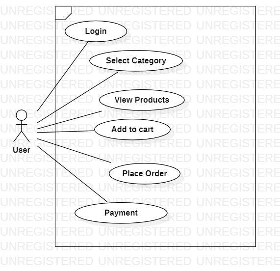

LOW LEVEL DESIGN:

PROJECT PURPOSE:

An e-commerce system provides real time data and analytics about your product and customer.

SYSTEM GOALS AND OBJECTIVES:

- Main activity screen consists of login page.
- Category page consists of select the categories of products from electronics, groceries, cosmetics and clothing.
- The cart page will let you add products to cart.
- Ensure that the product names, the quantity and the price of individual items entered is correct.
- There will be some tax amount in each category of product.
- The tax amount will be added into the price of the product and the payment option will appear.

PROJECT SCOPE:

- User: New users have to register here and registered users can login by giving username and password.
- Products: Registered users can order desired products from here. Each product should have a unique id, name and quantity.
- Manage orders: Users have to add name, address and phone number to manage their orders.
- Add to Cart: Users can select the items to cart that they want to purchase.
- Category: The user can choose product categories like electronics, 

clothing, cosmetics and groceries here.

- Payment: Once users orders products, they have to choose the payment option that is by cash or card.

USE CASE DIAGRAM:

